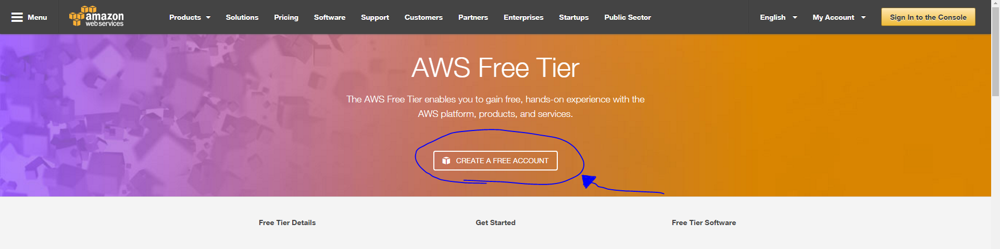
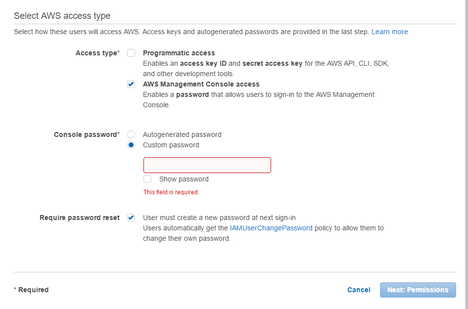
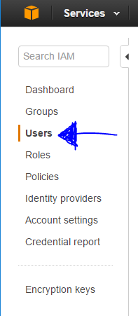
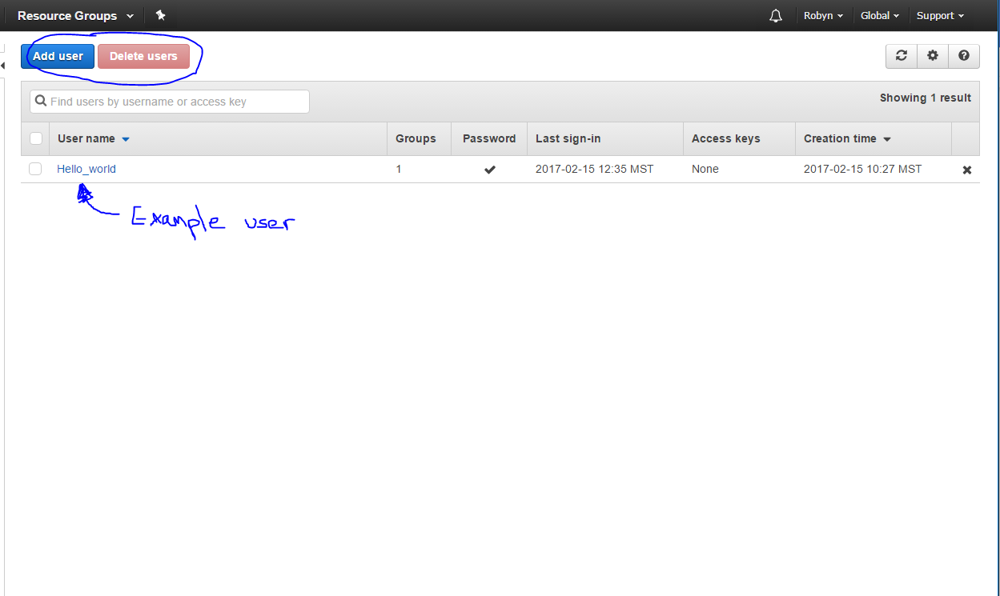

<div class="well" style="text-align: center;">
If you already have an AWS account, just go to <a href="{{site.baseurl}}/create.html">Portal creation</a>.
</div>


## 1. Sign up in AWS
* Go to the <a href="https://aws.amazon.com/s/dm/optimization/server-side-test/free-tier/free_np/">amazon</a> web services website. Click on start a <em>free</em> account. We generally recommend the small account (t2.small) as it has more space for recording data and won’t overwhelm as quickly as the micro account (t2.micro). However, if you are unsure as to which account will suit you the micro account is free the first year and you can upgrade if you end up running out of space. For more information on the instance types click on the link below.
<a href=" https://aws.amazon.com/ec2/instance-types/ "> https://aws.amazon.com/ec2/instance-types/ </a>

**Note:** when you first sign into your account it’s automatically signed up for all services in AWS (e.g. lambda). You are only charged for the services that you use. For more information visit <a href=" https://aws.amazon.com/lambda/  "> https://aws.amazon.com/lambda/  </a>


<br>
<hr>

* Enter your email and create a password. Make sure to select “I am a new user” If you don’t have an amazon account.
* Walk through their online setup and make a note of your **ID**
  - **Note:** <em>There will be a section where you will need to provide a credit card number and  make a phone call</em>
  
  
  Please <em>keep a note of your AWS account ID</em>, you'll need it next.

<br>
<hr>
  
## 2. Create an IAM User (Security)
* Sign into <em> Identity and Access Management</em> (IAM) console at <a href="https://console.aws.amazon.com/iam/">https://console.aws.amazon.com/iam/</a>
* In the navigation pane select **Users**, and then click <em>**Add User**</em>
<br>
<hr>


* Type in a user name.
  - Amazon.com states that, “The name can consist of letters, digits, and the following characters: plus (+), equal (=), comma (,), period (.), at (@), underscore (_), and hyphen (-). The name is not case sensitive and can be a maximum of 64 characters in length.” 
Quoted from http://docs.aws.amazon.com/lambda/latest/dg/setting-up.html

* Click the checkbox next to **AWS Management Console access**, select **Custom password**, type the new user’s password in the text box and unclick **Require password reset**. You can also select Programmatic access which will give the user more access to the key ID and secret access key



* When you hit next you’ll see a page about groups and users. Move onto the **Review** step. Here you can double check your user and what permissions they have before creating their account. If this looks OK, click on **Create user**.


## 3. Sign in as the new IAM user

* In the green "Success" shaded area, note the link at the bottom that says "Users with AWS Management Console access can sign-in at:", which looks like this:
````
https://[aws account number goes here].signin.aws.amazon.com/console/
````
 - Remember your AWS account ID? You’re going to use it as your aws_account_number without the hyphen. 
 
 e.g. 1234-5678-9101 is 123456789101 so the link you end up with should look like: 
 `````
 https://123456789101.signin.aws.amazon.com/console/
`````
**Note:** If you need to find your account number again go to “Your AWS Account ID and It’s Alias” at http://docs.aws.amazon.com/IAM/latest/UserGuide/console_account-alias.html

* Click on this link and enter the IAM username and password you made. Once you’ve successfully logged in your navigation bar at the top should show <em> your_user_name@your_aws_account_id </em>

## 4. To create or remove an account alias

* Sign into IAM (Identity and Access Management) https://console.aws.amazon.com/iam/
* Click on <em>**Services**</em> and then <em>**IAM**</em> 
* Click on Dashboard on the left side of the screen then <em>**Users**</em>



* Find the IAM <em>users sign-in</em> link
* To create the alias click **Customize** and enter the name you want. Once that’s done click on the **Add User**
* To remove the alias click **Customize** and then click **Delete Users**. This will revert the sign in URL to your AWS ID

* To sign in after it’s created use your ID URL
````
https://your_account_alias.signin.aws.amazon.com/console/
````
  
