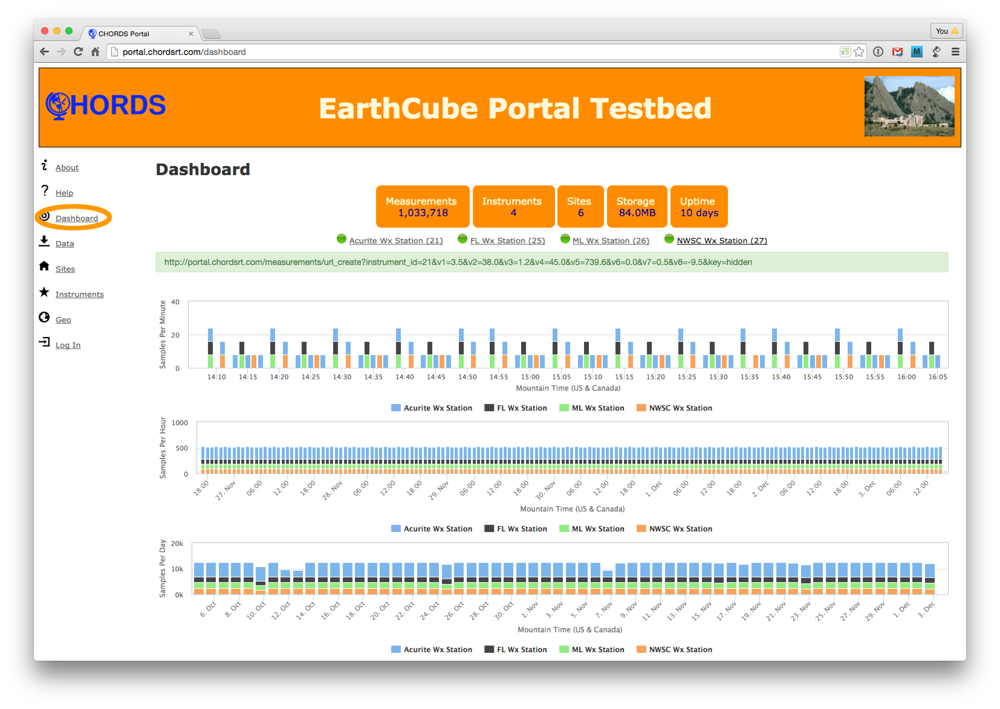
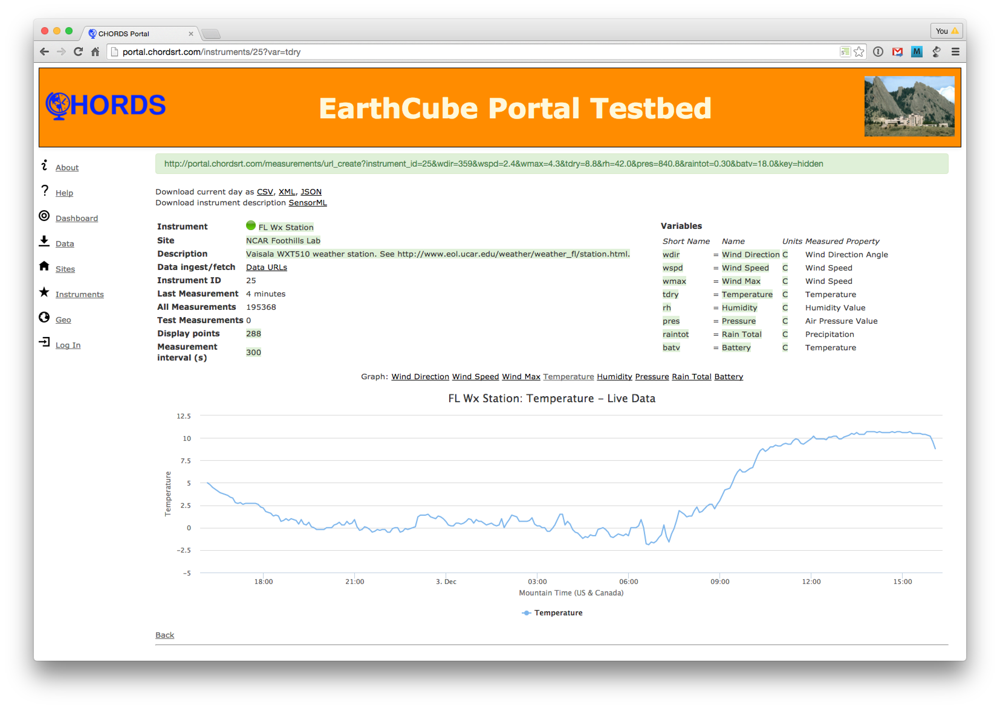
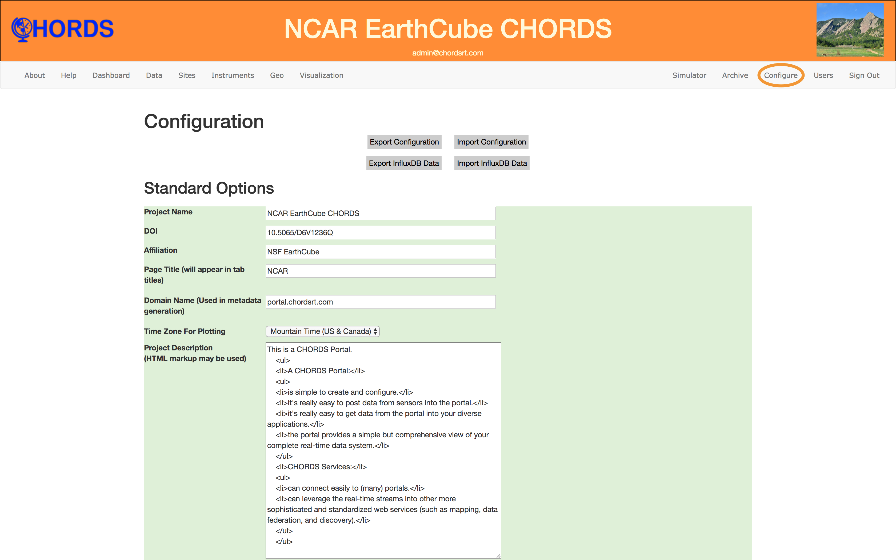
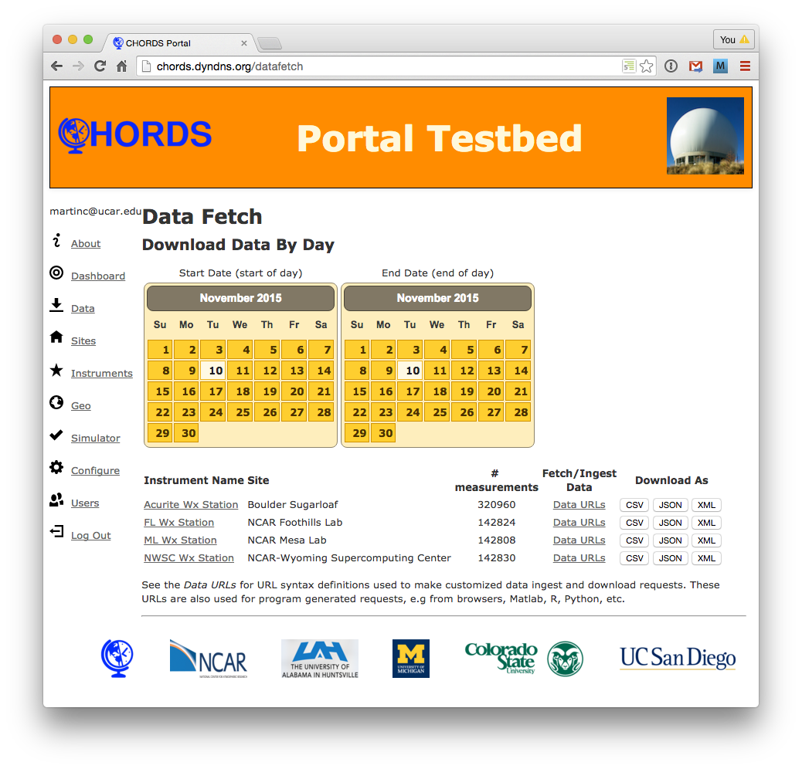
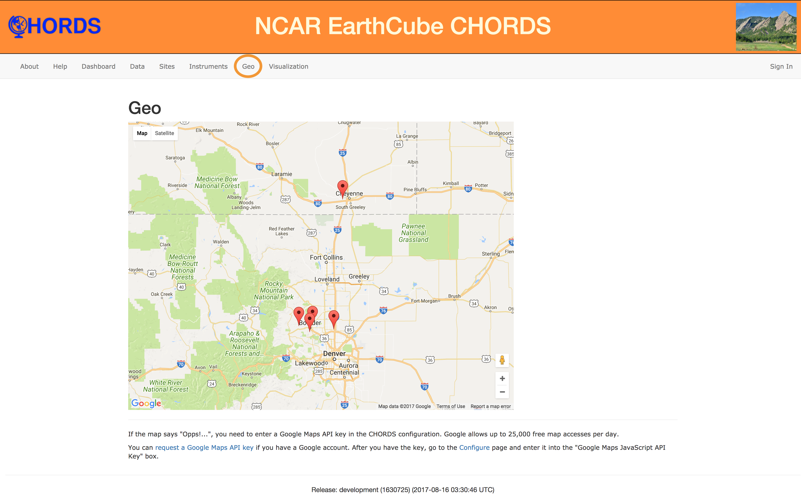
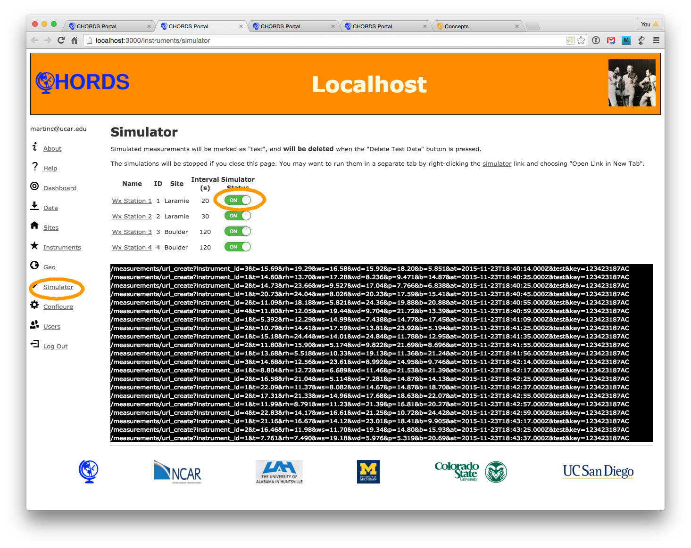

  <ul class="nav nav-pills">
    <li class="active"><a data-toggle="tab" href="#dashboard">Dashboard</a></li>
    <li><a data-toggle="tab" href="#data">Data</a></li>
    <li><a data-toggle="tab" href="#monitor">Monitoring</a></li>
    <li><a data-toggle="tab" href="#geo">Geo</a></li>
    <li><a data-toggle="tab" href="#sim">Simulation</a></li>
    <li><a data-toggle="tab" href="#config">Configure</a></li>
    <li><a data-toggle="tab" href="#terms">Terminology</a></li>
  </ul>

  

  
    

    
Some of the terminology used in CHORDS is described here.

    <table class = "table table-striped">
      <tbody>
        <tr>
          <td>URL</td>
          <td>Uniform Resource Locator: simply the same old Internet address and qualifiers that you are used to typing into
          the address bar of a browser. All CHORDS transactions are made via URLs.</td>
        </tr>
        <tr>
          <td>Site</td>
          <td>A geographic location, which may host one or more instruments. It is the only place where 
             geographic coordinates are specified, so if you need to identify a unique location for an instrument, it
             must be assigned to a distinct site. </td>
        </tr>
        <tr>
          <td>Instrument</td>
          <td>A source of related measurements. Typically it is one device, but you can designate multiple
          devices as a single instrument, or you can divide the measurements from a single device among
          multiple instruments, if this results in a more appropriate data organization. </td>
        </tr>
        <tr>
          <td>Variable</td>
          <td>A particular measurement made by an instrument, such as such as temperature, or pH.
          Variables have <em>Short Names</em></td>
        </tr>
        <tr>
          <td>Measurement</td>
          <td>A single observation of a Variable. Measurements are assigned to 
          instruments, and each one has an associated time of observation. Typically, multiple
          measurements for the same instrument are submitted together, with a common time tag.</td>
        </tr>
        <tr>
          <td>Short Name</td>
          <td>A compact identifier for a variable, which is used to represent it in a URL. This is done
          to keep URLs from becomming unreasonably long. For example, the short name for temperature
          might be assigned as <em>t</em>, pressure as <em>p</em>, etc. The short name should be as short as possible, but
          still be useful for identification.</td>
        </tr>
        <tr>
          <td>Data URL</td>
          <td>The syntax used to submit and fetch data from the Portal. "Data URL" links, found on several
          pages of the Portal, take you to a page which provides examples for a particular instrument.</td>
        </tr>
        <tr>
          <td>Format</td>
          <td>URL extensions usually indicate the type of data that will be returned to a data request:
            <table>
              <tr><td>.csv</td><td> A comma separated data file.</td></tr>
              <tr><td>.jsf</td><td> A JSON file.</td></tr>
              <tr><td>.xml</td><td> An XML file.</td></tr>
              <tr><td>.json</td><td> A JSON string.</td></tr>
            </table>
          </td>
        </tr>
        <tr>
          <td>Simulation</td>
          <td>The CHORDS Portal provides a capability to simulate your instrument data delivery. This
          is invaluable for configuring and testing your Portal, even before you have instruments deployed.
          Data that are submitted under simulation are tagged as test values, and can easily be removed
          from the database.</td>
        </tr>
      </tbody>
    </table>
    

    
    

      

      The dashboard provides an overview of your system performance. It's the default
      view, accesible from the top level domain name, the CHORDS logo, and the 
      Dashboard link.
      

      <ul>
        <li>The instrument links have status indicators which are green/red indicating if a measurement 
        has been received within the nominal reporting interval for the instrument.</li>
        <li>The most recent measurement URL is shown in the green box.</li>
        <li>Three bar graphs show the number of measurements received for each instrument,
        over different time spans.</li>
      </ul>
      
    

    
    

      

      Clicking on an instrument link (from the dashboard or instrument page 
      takes you to a page where you can monitor data from 
      that instrument. You can also modify the instrument configuration.
      

      <ul>
        <li>Select the variables to be plotted by selecting them below the graph.</li>
        <li>The time span and range can be adjusted with a drop down and slider.</li>
        <li>The graph has live updates. When a new measurement is recieved, it is plotted.</li>
        <li>The most recent URL received from the instrument is displayed in the green alert box.</li>
        <li>Configuration parameters appear in green boxes. You can edit them directly, to change the 
        setup for this instrument.</li>
      </ul>
      
    

    
    

      

      Configuration is used for managing many (but not all) of the portal characteristics. Sites, instruments,
      and variables are configured on their own specific pages.
      

      <ul>
        <li>You must be logged in with administrator access in order to modify the configuration.</li>
        <li>Be sure to press the save button at the bottom of the configuration sections.</li>
        <li>A backup copy of the configuration may be created and reloaded using the Export/Import
        Configuration buttons.</li>
        <li>A backup copy of the time-series database may be created and reloaded using Export/Import 
        Database buttons.</li>
      </ul>
      
    

    
    

      

      The top bar Data link takes you to a page where instrument data can be directly downloaded with
      a few button clicks. Old measurements can be trimmed from the database. Simple URLs can also be used by programs to 
      <a href="{{site.baseurl}}/dataout.html">fetch data</a>.
      

      <ul>
      <li>You can download instrument data for selected days in
      various file formats.</li>
      <li>Links are also provided to "Data URLs" pages, which describe how to 
      construct a data request for each instrument.</li>
      <li>Remember that data can also be fetched directly by <a href="{{site.baseurl}}/dataout.html">programs</a>. You don't have
      to download files.</li>
      </ul>
      
    

    
    

      

      The top bar Geo link takes you to a geographical display of site locations.
      

      <ul>
      <li>A Google API credential is required in order to show google maps on a web site. Anyone with a Google account can 
      <a href="https://console.developers.google.com/project/_/apiui/credential" target="_blank">create an API credential</a>. 
      The value is entered into the CHORDS configuration.</li>
      </ul>
      
    

    
    

      

      Simulation allows you to test the configuration and operation of your portal. This
      test data can be easily deleted when testing is completed.
      

      <ul>
      <li>Select Simulator from the top bar to open the simulation page. It's best to right-click 
      the link, and select "Open Link In New Tab".</li>
      <li>You can  individually toggle each intrument on/off.</li>
      <li>URLs with simulated measurements will be sent to the Portal, at the nominal instrument
      data rate.</li>
      <li>The "test" flag will be added to the measurements."</li>
      <li>If the simulation window is closed or you navigate away from it, the simulation will end.</li>
      </ul>
      
    

  

