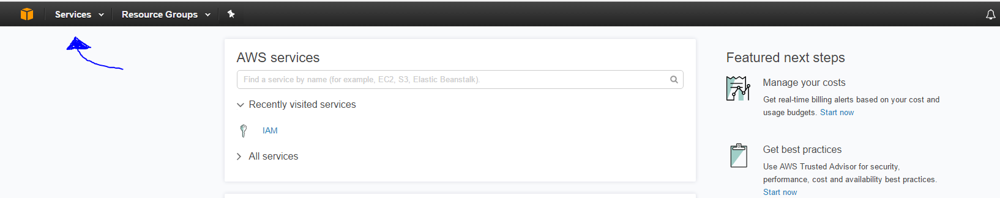
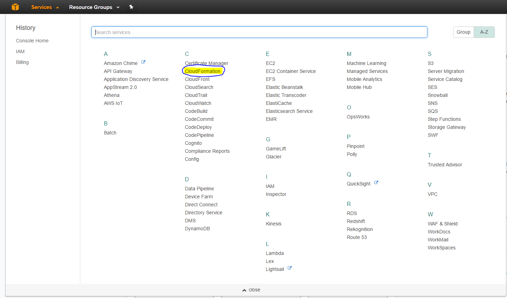
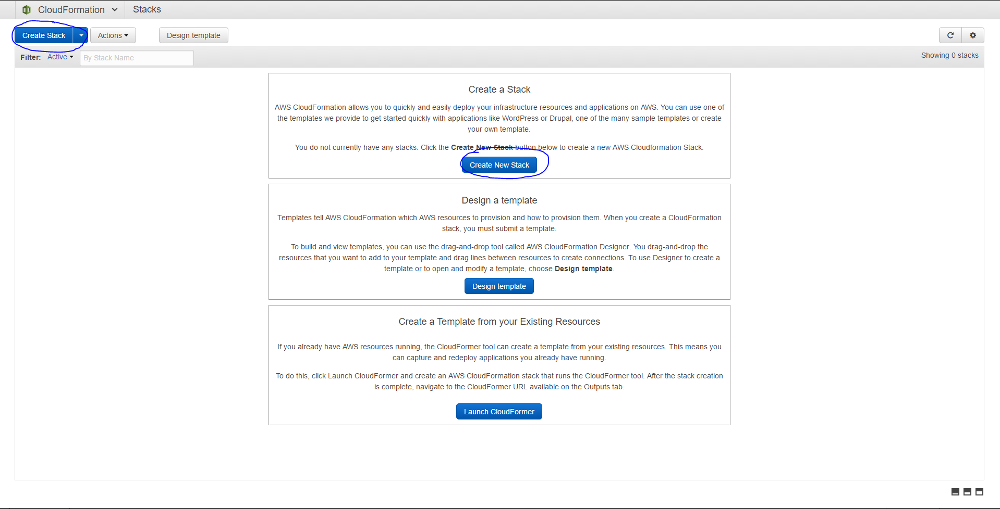
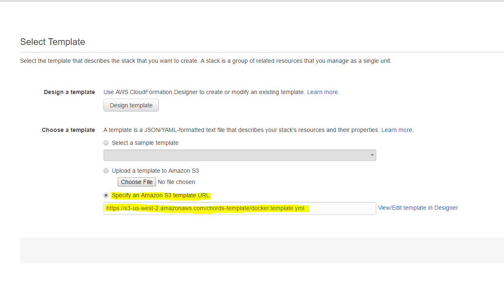
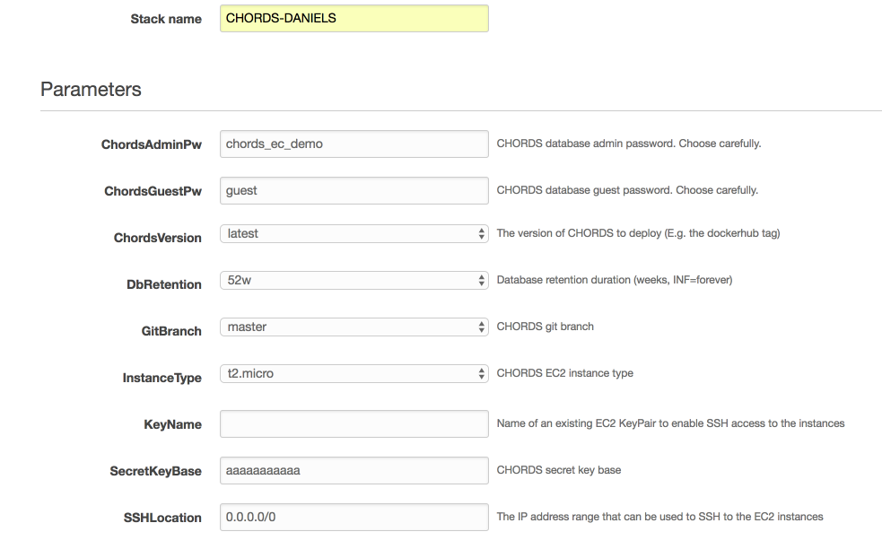
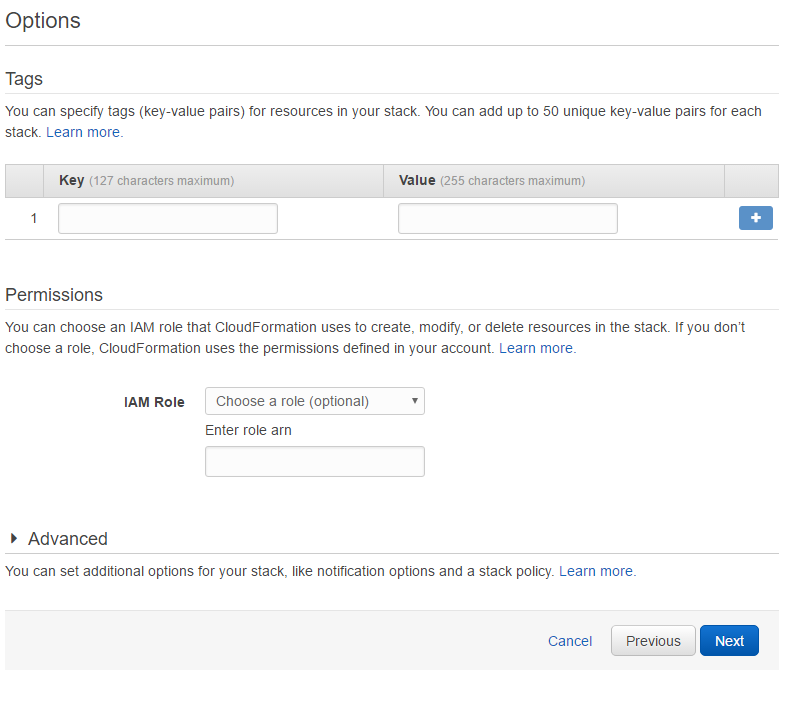
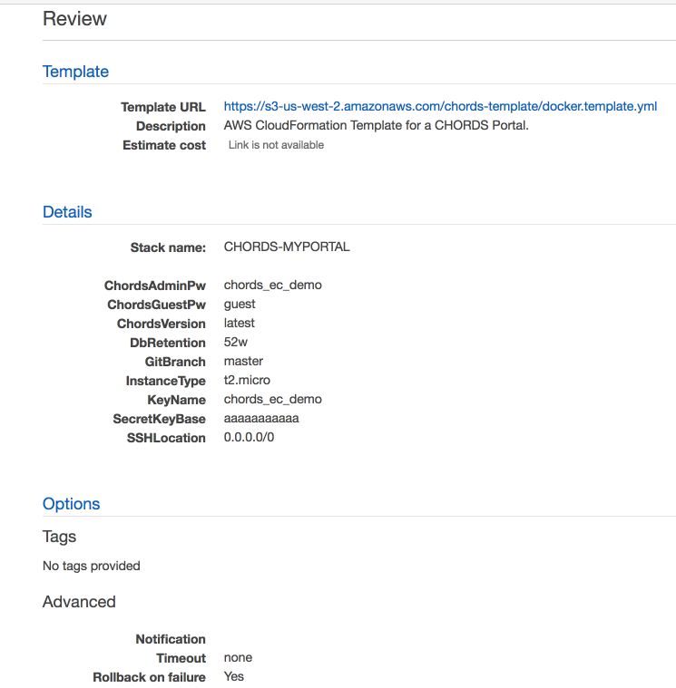
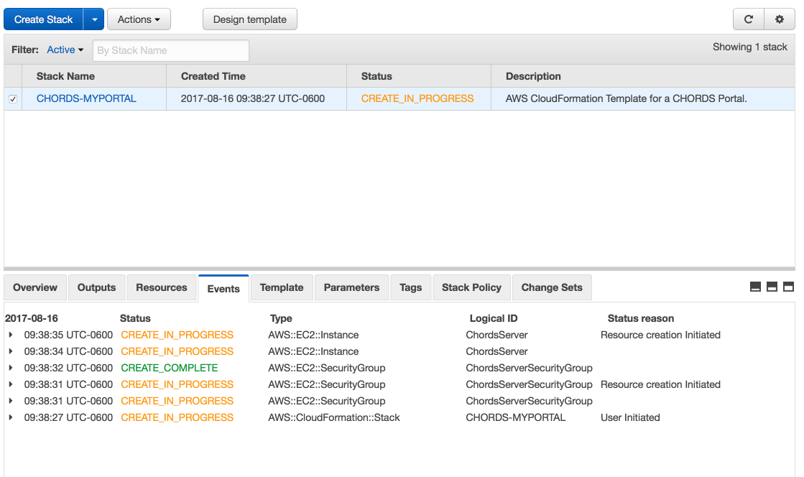
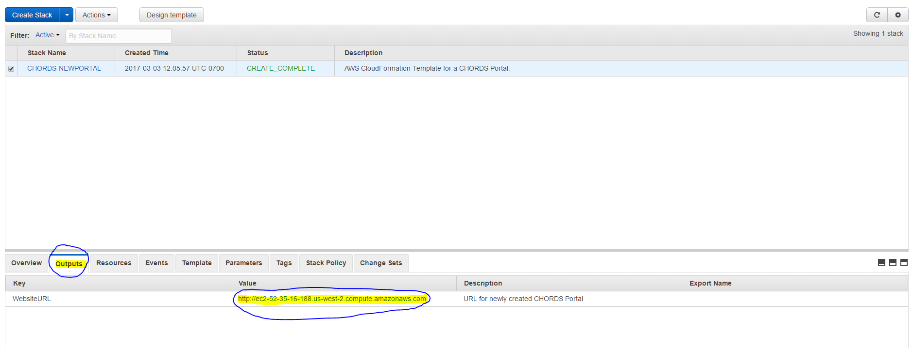
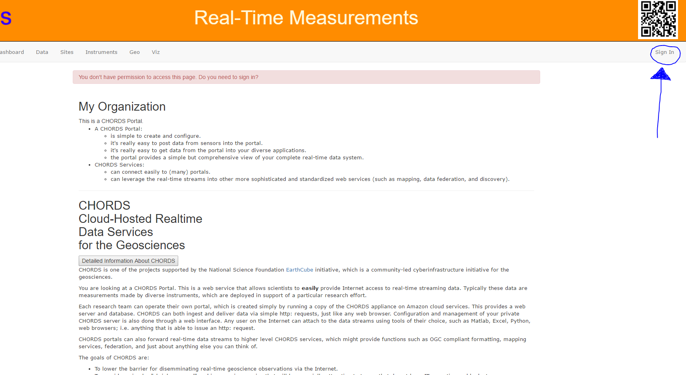

<div class="well" style="text-align: left;">
If someone else has already created a Portal for you, you can skip Portal creation. Just point
your browser at the new Portal and perform the initial login as user: <em>admin@chordsrt.com</em>, 
password: <em>realtimedata</em>. You will be prompted to change the password during this first login.
You can then proceed to <a href="{{site.baseurl}}/config.html">Portal configuration</a>.
</div>

The Portal runs as a standalone web server on Amazon Web Services (AWS). 
The interface to AWS can seem a bit overwhelming (currently offering 52
services!).

We use the **AWS CloudFormation** service to create a new portal. The steps are
simple.


Log onto your AWS account to begin.

## 1. Run CloudFormation

* First click on <em>“Services”</em> and then click on <em>“Cloud Formation”</em> 




      
## 2. Start stack creation and Specify template 



* Click **Create new stack**

* Click on **Specify Amazon S3 template URL** and Copy and Paste the following link in the box:
````
https://s3-us-west-2.amazonaws.com/chords-template/docker.template.yml
````



* Click **Next**


## 3. Specify the portal name and key

* Give the stack a name. The convention is _CHORDS-_ suffixed with your project or organization name, e.g. _CHORDS-CSURadar_.
* If you created a key for your Amazon account, select an EC2 KeyPair for *KeyName*. This will allow you to ssh into the instance, 
  if ever needed.
* Hit **Next**




## 4. Options
* Hit **Next**.



## 5. Review

* Verify that everything looks good and then click **Create**



## 6. Wait for the portal to be created
* After the creation has started, you will be taken 
to the stack summary page. Go to the *Events* tab to watch the progress 
of the stack creation. It usually takes about 6 minutes to complete, but it can take 
much longer (even 30 minutes), depending upon AWS performance.




## 7. Accessing the new portal

Once your portal is created click on the **“Outputs”** tab. Below it will show a URL for the new portal, **click** on the URL to access your new portal.



## 8. Log Into to Your CHORDS Portal
* Click on the **“Sign in”** 




Once the Portal is running, you will want to immediately change the admin acount and password to your
own email and password.

* Log into your new portal, as user: **admin@chordsrt.com**, and password: **realtimedata**.
* Go to the Users link, and change the user name from *admin@chordsrt.com* 
  to your *email address*.
* Logout of the Portal.
* Select **Forgot your password?**
* Enter your email and punch **send me reset password instructions**. 
* An email will be sent, containing a link that you can use to change the password on your account. **It's very likely that this email will go into your spam folder. Use the link to change your password to something secure.**

# If something breaks
* If the provisioning fails, the instance will be stopped, and you won\'t know why. You can redo the process, 
and disable the rollback, so that the instance is left running. To do this, when on the *Options* page, 
open the Advanced section, and change _Rollback on Failure_ to *No*. This will
keep the instance running when the provisioning fails, so that you can ssh in and diagnose the problem.
