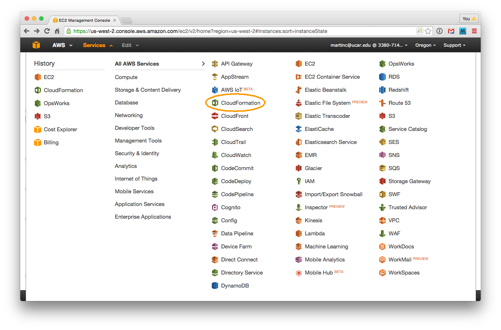
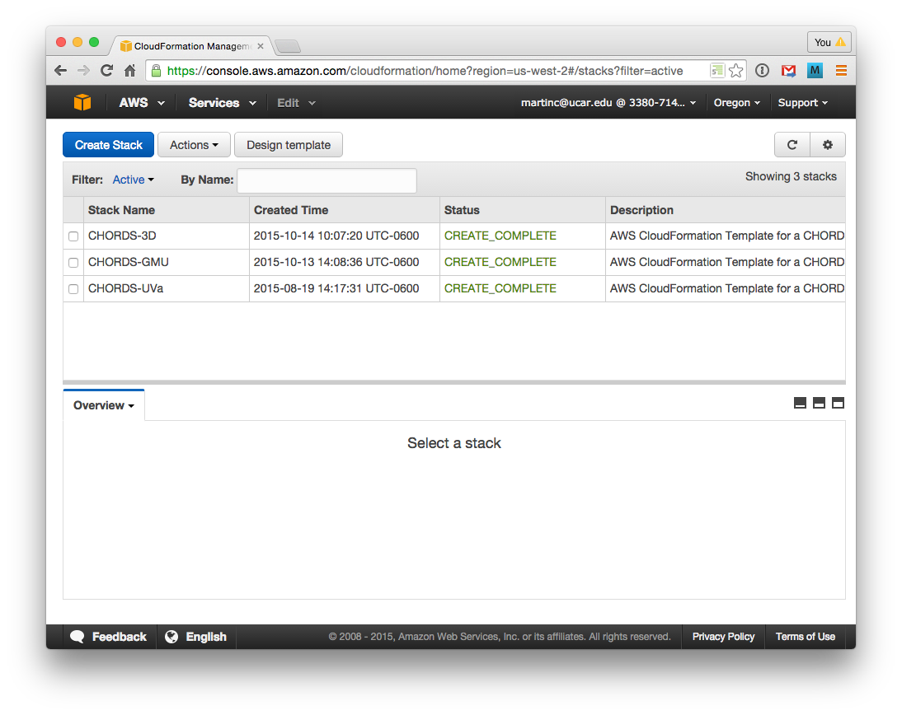
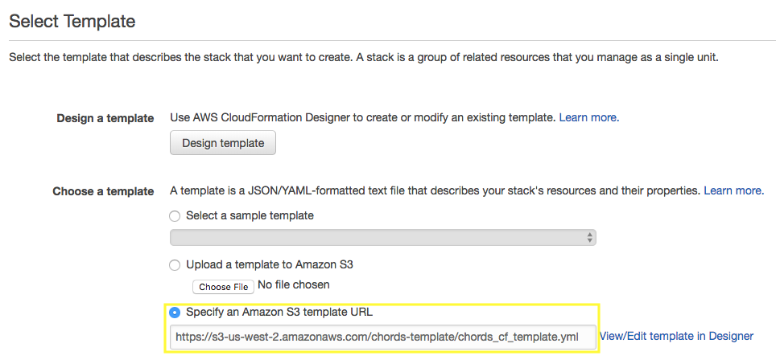
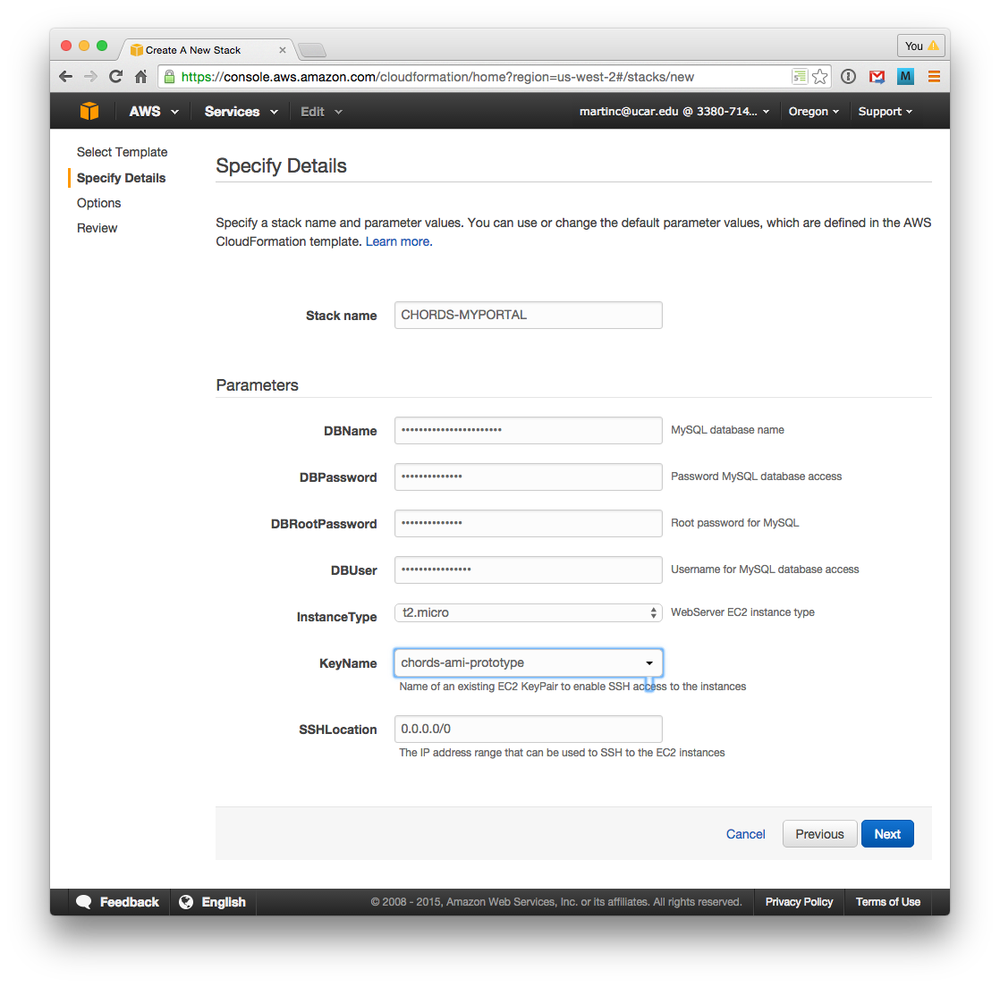
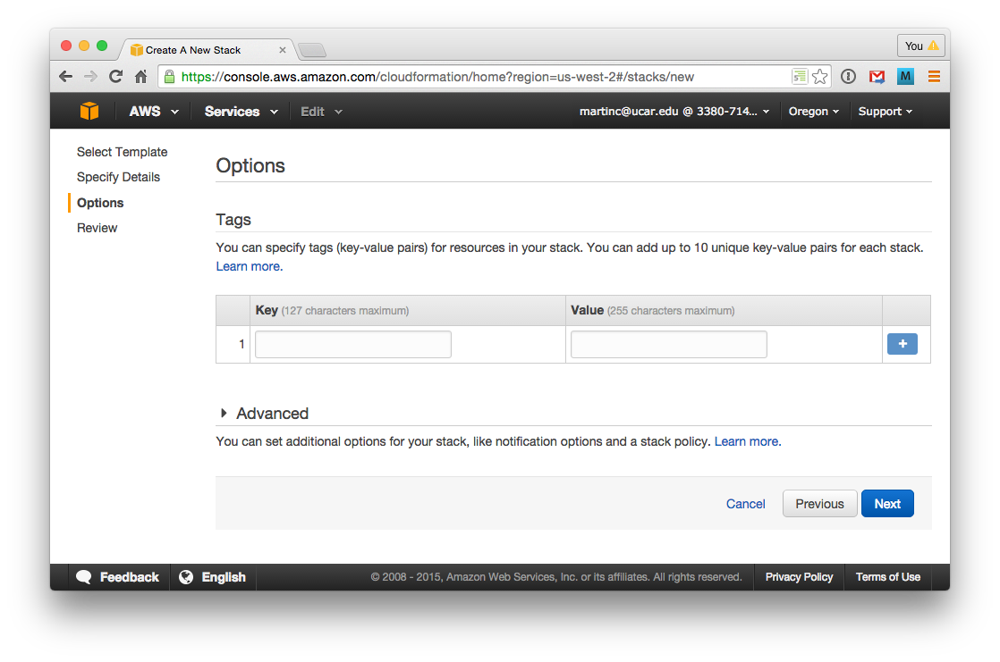
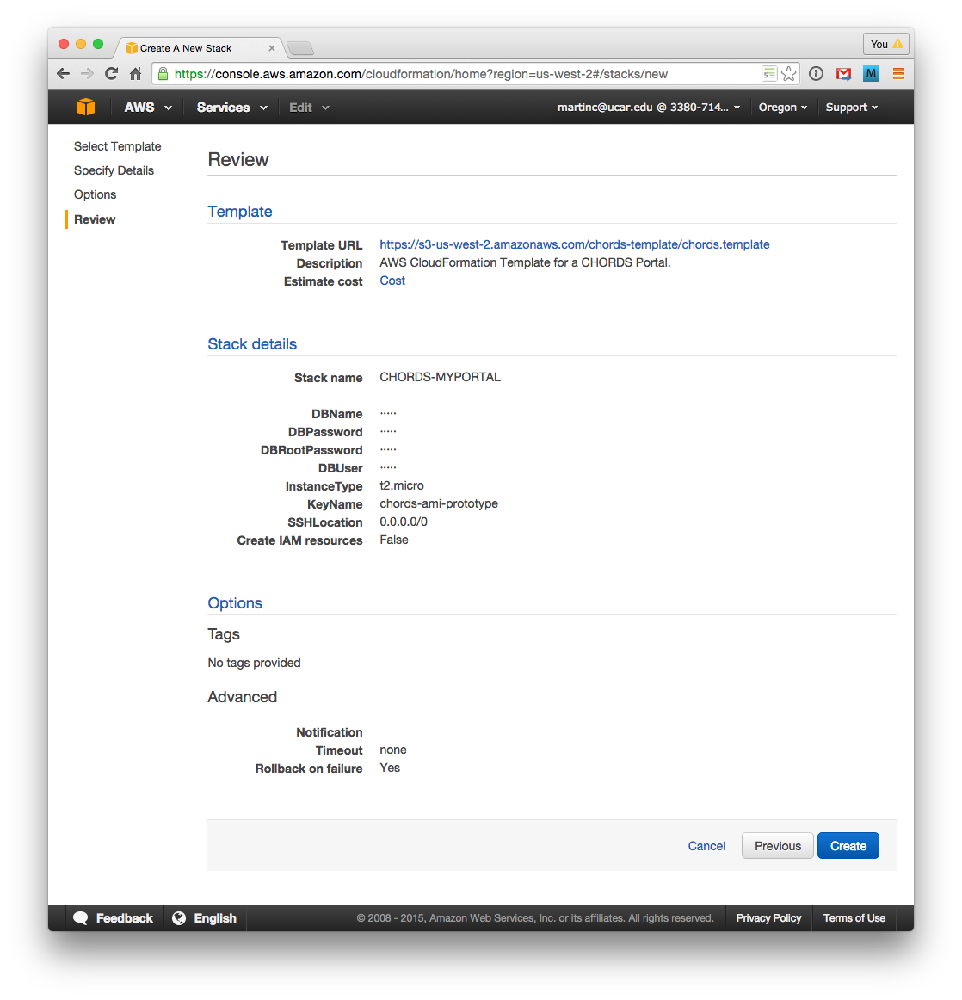
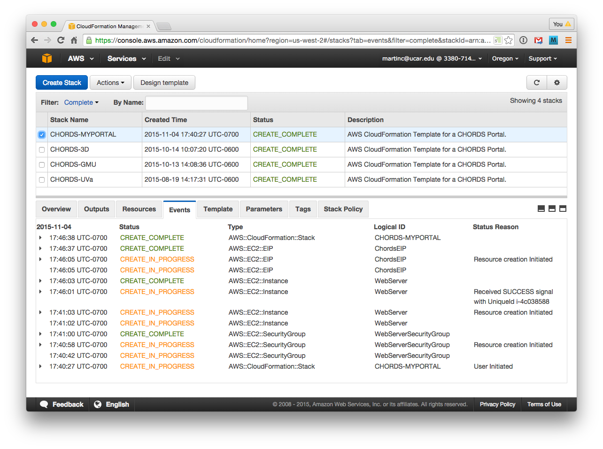
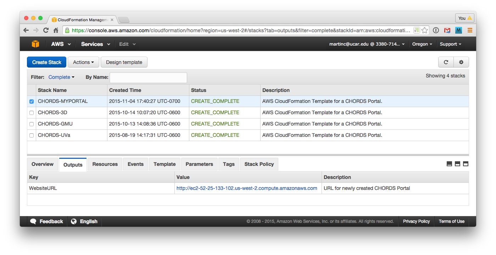
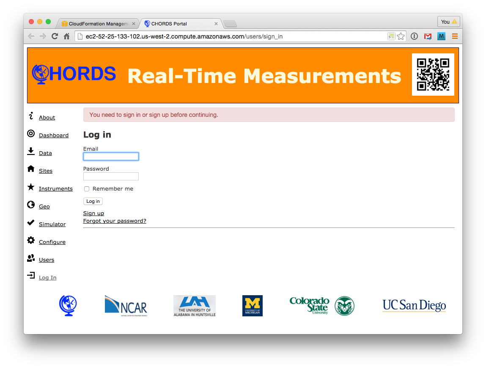

The Portal will run as a standalone web server on Amazon Web Services (AWS). 
The interface to AWS can seem a bit overwhelming (currently offering 52
services!). There are only two that are necessary for managing the Portal
on Amazon.

We use the **AWS CloudFormation** service to create a new portal. The
steps are given next. 

Log onto your AWS account to begin.

## 1. Run CloudFormation

* Choose  from the AWS Services dropdown.

      
## 2. Start stack creation

* AWS refers to a program as a *stack*. Mash *Create Stack* to start the CloudFormation wizard.

## 3. Specify a portal template 

* Paste the following link into _Specify an S3 template URL_:  
https://s3-us-west-2.amazonaws.com/chords-template/chords.template

## 4. Specify the portal name and key

* Give the stack a name. The convention is _CHORDS-_ suffixed with your project or organization name, e.g. _CHORDS-CSURadar_.
* Select an EC2 KeyPair for *KeyName*. This will allow you to ssh into the instance, if ever needed.

## 5. Options

* Hit _Next_.

## 6. Review

* Verify that everything looks good.
* Mash the *Create* button.

## 7. Wait for the portal to be created

* After the creation has started, you will be taken 
to the stack summary page. Go to the *Events* tab to watch the progress 
of the stack creation. It usually takes about 6 minutes to complete, but it can take 
much longer (even 30 minutes), depending upon AWS performance.

## 8. Access the new Portal

* Once the portal is created and running, the *Outputs* tab will provide a WebsiteURL for the new 
CHORDS Portal. Click on the link to access the Portal.

## 9. Log Into to Your CHORDS Portal

* Log into your new portal, as user *admin*, password *admin*.

# If something breaks
* If the provisioning fails, the instance will be stopped, and you won\'t know why. You can redo the process, 
and disable the rollback, so that the instance is left running. To do this, when on the *Options* page, 
open the Advanced section, and change _Rollback on Failure_ to *No*. This will
keep the instance running when the provisioning fails, so that you can ssh in and diagnose the problem.
