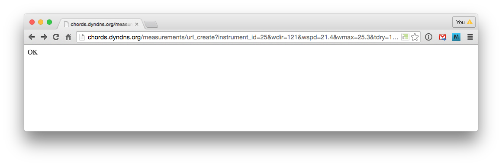

It is easy to submit new data to a Portal, simply using standard HTTP URLs. The URL can be submitted 
directly from the address bar of your browser (but of course this would get tedious).

We will first describe the URL syntax, and follow this with examples that demonstrate how easy it is to feed your
data to a CHORDS Portal, using Python, C, or a browser or the command line. Almost all programming languages 
have functions for submitting HTTP requests. These are only afew
of the languages that work, and you should be able to figure out a similar method for your own
particular langauge.

###  URL Syntax

A typical URL for submitting measurements to the Portal:

    http://myportal.org/measurements/url_create?instrument_id=25&wdir=038&wspd=3.2&at=2015-08-20T19:50:28

_myportal.org_ is the hostname of your Portal. The fields after "?" are quallifiers, each
separated by "&". 

Measurements for variables are specified by _shortname=value_ pairs. You do not need to include
measurements for all variables defined for the instrument, if they are not available.

<table class="table table-striped">
  <thead>
    <tr>
      <th>Qualifier</th>
      <th>Optional</th>
      <th>Meaning</th>
    </tr>
  </thead>
  <tbody>
    <tr>
      <td>instrument_id=id</td>
      <td>No</td>
      <td>The Portal assigned instrument identifier.</td>
    </tr>
    <tr>
      <td>at=time</td>
      <td>Yes</td>
      <td>Specify a timestamp to be applied to the measurements. If <em>at</em> is not specified,
      the measurement will be stamped with the time that it was received by the Portal (often 
      quite adequate). The time format is <a href="https://en.wikipedia.org/wiki/ISO_8601">ISO8061</a>.</td>
    </tr>
    <tr>
      <td>key=value</td>
      <td>Yes</td>
      <td>If the Portal has been configured to require a security key for incoming measurements, it
      is specified with the <em>key</em> qualifier. Keys are case sensitive.</td>
    </tr>
    <tr>
      <td>test</td>
      <td>Yes</td>
      <td>Add the <em>test</em> qualifier to signify that the measurements are to be marked as test 
      values. Test measurements may be easily deleted using the Portal interface.</td>
    </tr>
  </tbody>
</table>

### Programming Examples

<ul class="nav nav-pills">
  <li class="active"><a data-toggle="tab" href="#browser">Browser and Sh</a></li>
  <li><a data-toggle="tab" href="#python">Python</a></li>
  <li><a data-toggle="tab" href="#c">C</a></li>
</ul>

  

    
#!/usr/bin/python

# Put a collection of measurements into the portal
import requests
url = 'http://my-chords-portal.com/measurements/url_create?instrument_id=3&t=27.1&rh=55&p=983.1&ws=4.1&wd=213.5&key=1762341'
response = requests.get(url=url)
print response
...
<Response [200]>
      
    

    

    

    Data can be submitted to a portal just by typing the URL into the address bar of a browser. It's
    unlikely that you would use this method for any serious data collection!
    

    
    

    The <em>wget</em> and <em>curl</em> commands, available in Linux and OSX, can accomplish the same thing 
    from a console. 
    

    
wget http://chords.dyndns.org/measurements/url_create?instrument_id=25&wdir=121&wspd=21.4&wmax=25.3&tdry=14.3&rh=55&pres=985.3&raintot=0&batv=12.4&at=2015-08-20T19:50:28&key=A5F461B1
    
curl http://chords.dyndns.org/measurements/url_create?instrument_id=25&wdir=121&wspd=21.4&wmax=25.3&tdry=14.3&rh=55&pres=985.3&raintot=0&batv=12.4&at=2015-08-20T19:50:28&key=A5F461B1
    
  

  

  

  This example uses the <a href="http://curl.haxx.se/libcurl/c/libcurl.html">libCurl</a> library in a 
  C program to send a measurement URL to a portal. 
  

  
#include <stdio.h>
#include <curl/curl.h>
 
int main(void)
{
  CURL *curl;
  CURLcode res;
 
  curl = curl_easy_init();
  if(curl) {
    char* url = "http://chords.dyndns.org/measurements/url_create?instrument_id=25&wdir=121&wspd=21.4&wmax=25.3&tdry=14.3&rh=55&pres=985.3&raintot=0&batv=12.4&at=2015-08-20T19:50:28&key=A5F461B1";
    curl_easy_setopt(curl, CURLOPT_URL, url);
    /* example.com is redirected, so we tell libcurl to follow redirection */ 
    curl_easy_setopt(curl, CURLOPT_FOLLOWLOCATION, 1L);
 
    /* Perform the request, res will get the return code */ 
    res = curl_easy_perform(curl);
    /* Check for errors */ 
    if(res != CURLE_OK)
      fprintf(stderr, "curl_easy_perform() failed: %s\n",
              curl_easy_strerror(res));
 
    /* always cleanup */ 
    curl_easy_cleanup(curl);
  }
  return 0;
}

  

