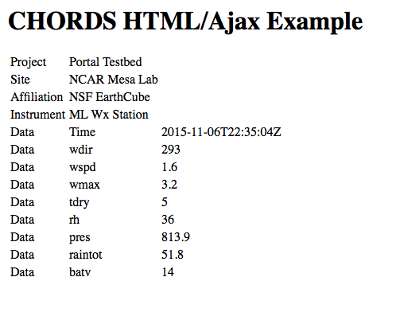

It's just as easy to get data out of a Portal as it is to put data in. Once again, you use HTTP URL's to
fetch data. The URL can be submitted directly from the address bar of your browser, which will
deliver the data in standard formats such as CSV files, JSON files, or plain JSON. 

You can also retrieve data using your favorite programming language, letting you build
analysis and visulaization apps that can process your real-time observations. Using JavaScipt,
you can even build widgets and pages that display your data on your own web site.

We will first describe the URL syntax for retrieving data, and follow this with examples that 
demonstrate how easy it is to integrate your analysis activities with a CHORDS Portal using
[Python](#python), [HTML](#html), [IDL](#idl), [Matlab](#matlab), [R](#r), [sh](#sh), etc. You
get the idea.

_Insert a description of the URL get syntax_

## Python


# Fetch the most recent measurements from a portal
import json, requests
url      = 'http://my-chords-portal.com/instruments/3.json?last'
response = requests.get(url=url)
data     = json.loads(response.content)
print json.dumps(data, indent=4, sort_keys=True)
...
{
    "Affiliation": "My Organization", 
    "Data": {
        "Time": [
            "2015-10-30T14:45:17Z"
        ], 
        "b": [
            13.49
        ], 
        "p": [
            22.55
        ], 
        "rh": [
            16.52
        ], 
        "t": [
            23.35
        ], 
        "wd": [
            19.82
        ], 
        "ws": [
            12.12
        ]
    }, 
    "Instrument": "Wx Station 3", 
    "Project": "Localhost", 
    "Site": "Boulder"
}

## HTML with JavaScript

_It appears that there may be cross-domain security issues with this approach. We need to
look into this._


<h1>CHORDS HTML/Ajax Example</h1>


Result:

## IDL


url='http://chords.dyndns.org/instruments/26.json?last'
oUrl = OBJ_NEW('IDLnetUrl')
json_data = oUrl->Get(URL=url, /STRING_ARRAY)
data = JSON_PARSE(json_data)
data
...
{
    "Project": "CHORDS Testbed",
    "Site": "NCAR Mesa Lab",
    "Affiliation": "NSF EarthCube",
    "Instrument": "ML Wx Station",
    "Data": {
        "Time": [
            "2015-07-28T22:15:51.000Z"
        ],
        "wdir": [
            105.00000000000000
        ],
        "wspd": [
            2.1000000000000001
        ],
        "wmax": [
            5.5000000000000000
        ],
        "tdry": [
            26.000000000000000
        ],
        "rh": [
            24.300000000000001
        ],
        "pres": [
            814.29999999999995
        ],
        "raintot": [
            453.69999999999999
        ],
        "batv": [
            13.900000000000000
        ]
    }
}


## Matlab


% Read CHORDS JSON data into a Matlab program.
% This code uses the JSONlab toolbox from the Matlab File Exchange.
% (Matlab >= R2014b)
url='http://chords.dyndns.org/instruments/26.json?last';
json_data = urlread(url);
inst_data =loadjson(json_data);
inst_data
inst_data.Data
...
inst_data = 

        Project: 'CHORDS Testbed'
           Site: 'NCAR Mesa Lab'
    Affiliation: 'NSF EarthCube'
     Instrument: 'ML Wx Station'
           Data: [1x1 struct]

ans = 

       Time: {'2015-07-28T21:00:51.000Z'}
       wdir: 135
       wspd: 1.4000
       wmax: 4.3000
       tdry: 26.3000
         rh: 24.7000
       pres: 814.6000
    raintot: 453.7000
       batv: 13.9000

>> 


## R


install.packages('curl')
install.packages('jsonlite')
library('jsonlite')

url <- 'http://chords.dyndns.org/instruments/26.json?last'
data <- fromJSON(txt=url)
data
...
$Project
[1] "CHORDS Testbed"

$Site
[1] "NCAR Mesa Lab"

$Affiliation
[1] "NSF EarthCube"

$Instrument
[1] "ML Wx Station"

$Data
$Data$Time
[1] "2015-07-28T21:35:51.000Z"

$Data$wdir
[1] 80

$Data$wspd
[1] 3

$Data$wmax
[1] 5.8

$Data$tdry
[1] 25.7

$Data$rh
[1] 24.4

$Data$pres
[1] 814.4

$Data$raintot
[1] 453.7

$Data$batv
[1] 13.9


## sh


#!/bin/sh

urlcsv='http://chords.dyndns.org/instruments/26.csv?last'
urljson='http://chords.dyndns.org/instruments/26.json?last'

echo 'CSV format:'
curl $urlcsv

echo 'JSON format:'
curl $urljson

echo
...

CSV format:
Project,CHORDS Testbed
Site,NCAR Mesa Lab
Affiliation,NSF EarthCube
Instrument,ML Wx Station
Time,Wind Direction,Wind Speed,Wind Max,Temperature,Humidity,Pressure,Rain Total,Battery
2015-07-28 22:30:51 UTC,75.0,2.5,6.4,26.3,25.3,814.3,453.7,13.9

JSON format:
{"Project":"CHORDS Testbed","Site":"NCAR Mesa Lab","Affiliation":"NSF EarthCube","Instrument":"ML Wx Station","Data":{"Time":["2015-07-28T22:30:51.000Z"],"wdir":[75.0],"wspd":[2.5],"wmax":[6.4],"tdry":[26.3],"rh":[25.3],"pres":[814.3],"raintot":[453.7],"batv":[13.9]}}


