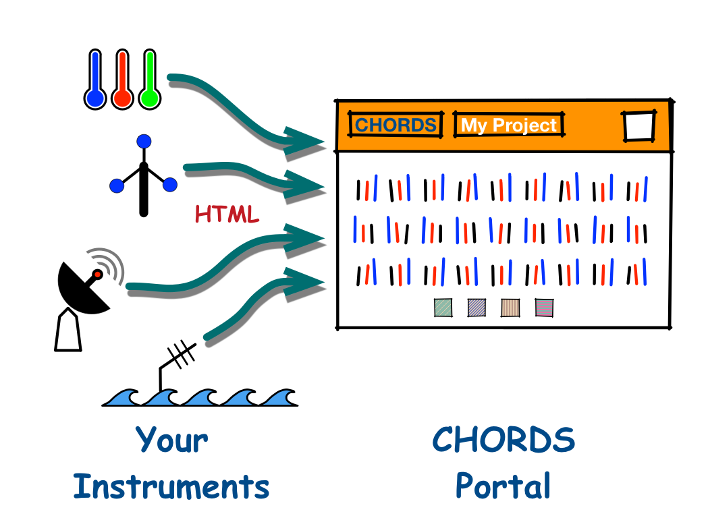

"[Cloud-Hosted Real-time Data Services for the Geosciences (CHORDS)](http://earthcube.org/group/chords) is a real-time data services infrastructure that will provide an easy-to-use system to acquire, navigate and distribute real-time data streams via cloud services and the Internet. It will lower the barrier to these services for small instrument teams, employ data and metadata formats that adhere to community accepted standards, and broaden access to real-time data for the geosciences community."

CHORDS consists of two components: a real-time instrument data management server (_Portal_), and a collection
of higher level web-services that provide advanced, standards based processing (_Services_).

  <h2>This web site is about the CHORDS Portal</h2>

## The CHORDS Portal is a

* **web server** that accepts real-time data from distributed instruments, and serves 
the measurements to anyone on the Internet. The data streams are pushed to and pulled from the Portal using 
simple HTTP requests. 
* **management tool** that allows you to monitor your remote instruments, insure correct operation, and maximize data collection.
* **rolling archive** from which scientists and analysts can easily fetch the data in
real-time, delivered directly to browsers, programs and mobile apps.
One click brings you a CSV file. A few lines of code brings data directly into your analysis programs.
* **entry point** to sophisticated real-time web services that can convert your data streams to
standardized formats such as OGC, and provide mapping, visualization, discovery, aggregation and 
many other web-enabled functions. 

## Owning a Portal

The Portal is targeted at users who do not have IT staffs and budgets. It is an appliance which you 
run on Amazon Web Services:

* **Ownership:** You have complete control of the portal. You create it and manage it yourself, without
having to rely on external tech support.
* **It's Cheap:** The portal, for a modest network of instruments (say 10), will cost about $0.50 a day to operate
on Amazon.
* **Setting It Up:** The one requirement is a credit card, to create an Amazon Web Services account. From
your account, you will follow a short recipe to create a new Portal (server) running on Amazon. 
You then go to your Portal web page and configure it for your project.

## The One Gotcha

Nothing is entirely free. You will need to adapt your instrument to send the URL's containing
your measurements, to your Portal. But usually this is not too hard. Your instrument may already 
have an Internet connection, and you just need to add a few lines to a processing script. Maybe you will need to
add a USB cell modem to your data acquisition computer. Or perhaps you need to add a $50 _Rasberry Pi_ to provide 
translation from an instrument to the network. Chances are that since you deploy instruments, you are already 
pretty handy in this area. In any event, we can offer advice on getting connected. And this web site already has
code examples for accessing the portal from many languages.

## Current and Future

A the moment the Portal only processes time-series measurements. We will soon be adding a data type for
soundings. Plans are under way to add additional data types, such as ray-oriented measurements and imagery.
And we are always open to suggestions for other observation types.

